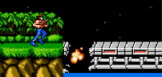
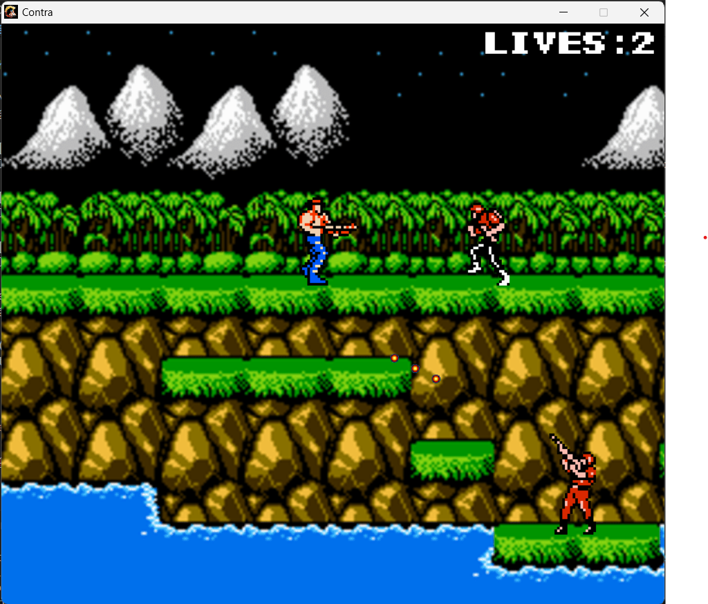
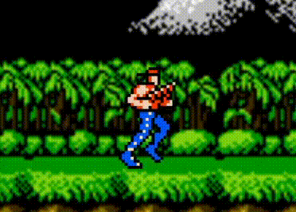
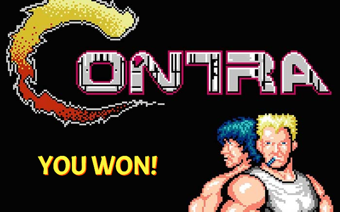

# Contra - HVP-Edition

- Demo game: https://drive.google.com/drive/folders/19YgoPM-l3qnHFJII6gBw79AC55ggN7K7?usp=sharing

# Giới thiệu game

Chắc chắn thế hệ 8x và nửa đầu 9x đều biết đến game Contra “huyền thoại”. Ai đó tự xưng mình là game thủ chắc chắn phải biết đến tựa game cực đỉnh này. Contra là tựa game ra đời năm 1987 cho hệ máy NES, du nhập vào Việt Nam những năm đầu thập kỉ 90 dưới cái tên “điện tử băng”. Contra được đánh giá là một trong những game đi cảnh, nhập vai 2D kinh điển và hay nhất.

- [Contra - HVP-Edition](#contra---hvp-edition)
- [Giới thiệu game](#giới-thiệu-game)
- [0. Cách tải game](#0-cách-tải-game)
- [1. Bắt đầu game](#1-bắt-đầu-game)
- [2. Các thành phần trong game:](#2-các-thành-phần-trong-game)
- [3. Cách chơi](#3-cách-chơi)
- [4. Chiến thắng và thất bại](#4-chiến-thắng-và-thất-bại)
    - [Về âm thanh đồ họa của game:](#về-âm-thanh-đồ-họa-của-game)
    - [Về source code game:](#về-source-code-game)

# 0. Cách tải game

**Bước 1:** Clone repo này về (273 MB).
Hoặc Chọn Code -> Download Zip (66.8 MB).

**Bước 2:** Cài đặt môi trường. Cài đặt theo hướng dẫn ở mục "Installing the MinGW-w64 toolchain" trong link https://code.visualstudio.com/docs/cpp/config-mingw.

**Bước 3:** Bật Contra.exe và chơi.

# 1. Bắt đầu game

Ấn phím mũi tên lên xuống trên bàn phím để chọn chơi 1 người hay 2 người, sau đó ấn Enter để xác nhận chọn (Chức năng 2 người chơi chưa phát triển nên khi chọn 2 người chơi sẽ tự động chuyển thành 1 người chơi).

# 2. Các thành phần trong game:

-    Player (Người chơi) 
      : là nhân vật bạn điều khiển.

-    Enemy1 
      : là 1 loại kẻ địch, loại kẻ địch này sẽ xuất hiện và di chuyển khi bạn đi đến một vị trí nào đó, va chạm với kẻ địch sẽ làm nhân vật mất mạng.

-    Enemy2 
      : là 1 loại kẻ địch, loại kẻ địch này sẽ xuất hiện và bắn về phía bạn khi bạn đi đến một vị trí nào đó, va chạm với kẻ địch hoặc đạn của kẻ địch sẽ làm nhân vật mất mạng.

-    Enemy3 
      : là 1 loại kẻ địch, loại kẻ địch này sẽ xuất hiện và bắn về phía bạn khi bạn đi đến một vị trí nào đó, va chạm với đạn của kẻ địch sẽ làm nhân vật mất mạng.

-    Explosive bridge (Cây cầu nổ) 
      :  sẽ bắt đầu nổ khi người chơi đến gần, ấn nút nhảy hợp lí để không bị rơi khỏi cầu khi cầu nổ.

- Thanh mạng (Góc trên bên phải) 
      : Hiển thị số mạng còn lại của người chơi. Khi hết mạng người chơi sẽ phải chơi lại từ đầu.

- Bố cục game cơ bản:

 

# 3. Cách chơi

Di chuyển tiến lên phía trước, tránh đạn để không chết, bắn kẻ địch để tiêu diệt kẻ địch.

Dùng nút mũi tên trái phải trên bàn phím để di chuyển trái phải.

Dùng nút mũi tên lên trên bàn phím để ngắm lên phía trên.
+ Ấn mũi tên lên khi đứng yên thì nhân vật sẽ hướng súng thẳng đứng lên trên.

+ Ấn mũi tên lên khi di chuyển trái (phải) thì nhân vật sẽ hướng súng lên góc trên bên trái (phải) khi di chuyển.

Dùng nút mũi tên hướng xuống trên bàn phím để nằm hoặc ngắm bắn bên dưới:
+ Ấn mũi tên hướng xuống khi đứng yên thì nhân vật sẽ nằm xuống.

+ Ấn mũi tên hướng xuống khi di chuyển trái (phải) thì nhân vật sẽ hướng súng lên góc dưới bên trái (phải) khi di chuyển.

Ấn nút Z để bắn.

Ấn nút X để nhảy hoặc rơi xuống (Khi đang nằm, ấn nút X để rơi xuống).

# 4. Chiến thắng và thất bại

- Bạn sẽ chiến thắng nếu đi đến cuối bản đồ mà không chết.

- Bạn sẽ thất bại nếu chết hết 3 mạng.

---
### Về âm thanh đồ họa của game:

Sử dụng trên Internet và có chỉnh sửa đôi chút.
Nguồn:
+ https://github.com/david-campos/Contra
+ https://www.alamy.com/loser-stamp-loser-sign-round-grunge-label-image385127990.html
+ https://nesmaps.com/maps/Contra/sprites/ContraSprites.html

### Về source code game:

- Folder include:
    * folder headers: chứa các headers do tôi tạo ra chứa các class được dùng trong game.
      + Object.h: chứa class Object là class cơ bản đại diện cho các vật trong game, được dùng để kế thừa cho các object cụ thể.
      + Bridge.h: chứa class Bridge kế thừa từ class Object để tạo ra cây cầu nổ.
      + Player.h: chứa class Player để tạo ra nhân vật người chơi điều khiển, nhận vào input là các phím người chơi bấm và xử lí logic cho nhân vật người chơi điều khiển.
      + Bullet.h: chứa class Bullet để tạo ra các danh sách đạn cho người chơi và kẻ địch.
      + Constants.h: include các thư viện cần thiết và khai báo các hằng số sử dụng cho toàn game.
      + Enemy.h: chứa các class các loại kẻ địch và xử lí hành động của kẻ địch.
      + Explosion.h: chứa class Explosion để tạo vụ nổ cho Bridge.
      + Game.h: chứa class Game xử lí logic chung của game (gameloop, tạo danh sách kẻ địch, xử lí va chạm giữa các đối tượng, ...)
      + Map.h: chứa class GameMap để quản lí tile map cho game.
      + Timerh: chứa class Timer để xử lí về thời gian để cố định FPS cho game.   
    * folder sdl: chứa các headers của thư viện sdl2, sdl_mixer, sdl_img, sdl_ttf.
- Folder lib: chứa các library của thư viện sdl2, sdl_mixer, sdl_img, sdl_ttf.
- Folder map: chứa tile map của game:
    * 0 là tile trống
    * 1 là tile đất
    * 2 là tile cầu
    * 3 là tile biển
- Folder res: chứa các tài nguyên dùng trong game:
    * folder font: chứa font chữ dùng trong game.
    * folder img: chứa các spritesheet của nhân vật, kẻ địch, cầu, ... và các ảnh khác dùng trong game.
    * folder sound: chứa các file âm thanh dùng trong game.
    * folder preview: chứa các file ảnh dùng để preview game trong README.md.
- Folder src: chứa các file mã nguồn .cpp định nghĩa các phương thức của các class trong headers file và file main.cpp.

